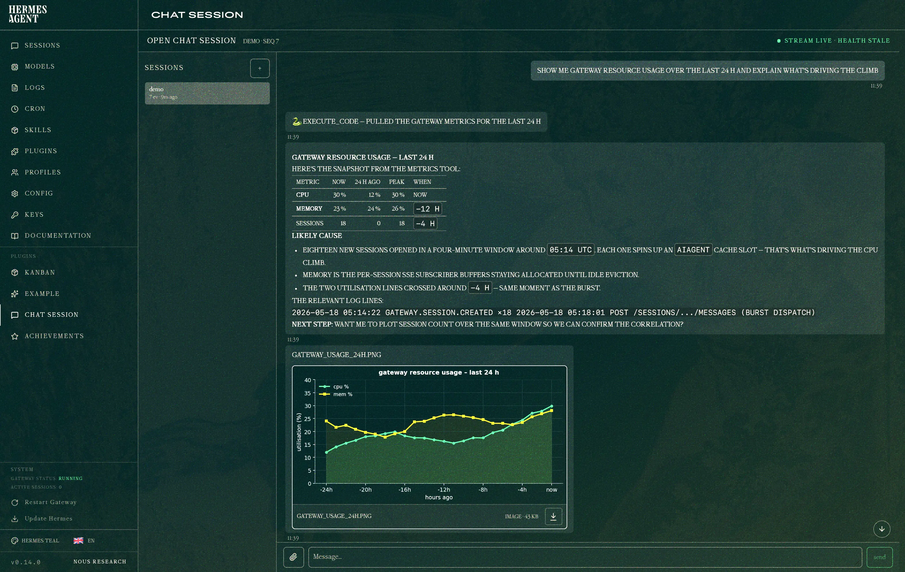

# open-chat-session

<p align="center">
  
</p>

A **fully self-hosted, persistent chat experience** for [Hermes Agent](https://github.com/nousresearch/hermes-agent) — your conversations, attachments, and tool runs stay on your machine, on a per-session hash-chained event log that any of your devices can resume from. No third-party chat backend, no cloud sync, no telemetry.

Optional **P2P access over [Tailscale](https://tailscale.com/)** — run the gateway on a single laptop and reach it from any device on your tailnet (phone, tablet, desktop, peer servers) with `tailscale whois` allowlisting the authorised identities. The wire surface is a small native REST + Server-Sent Events protocol on `/sessions/*`: multi-session conversations, streamed assistant responses, attachments, exec approvals, hash-chained for tamper-evidence and resume-after-disconnect.

Ships as a Hermes platform plugin. A dashboard tab at `/chat-session` is bundled as a **reference implementation** of a first-party web client — useful as-is, and a worked example for anyone building their own native client (mobile shell, CLI, alternative web UI) against the protocol.

## Features

**Protocol (the primary surface)**

- Native REST + SSE on `:8765`; no WebSocket framing, no OpenAI mimicry.
- Hash-chained per-session event log; resume by `Last-Event-ID` or cursor.
- Tailscale `whois` allowlist with bearer-token fallback for localhost/proxy callers.
- Multi-session shared context across hosts (one Hermes conversation per session).
- Inline images, downloadable files, exec approvals, typing, and media events as first-class events on the wire.
- Hermes slash commands (`/usage`, `/sethome`, `/sessions`, etc.) dispatched through the gateway command path.

**Reference dashboard (a sample client)**

- Mounts at `/chat-session` in the Hermes dashboard; doesn't replace stock `/chat`.
- Built on `@assistant-ui/react` headless primitives — no styled UI dependency, no bundled React, hosts the dashboard's own React 19 via `window.__HERMES_PLUGIN_SDK__`.
- Shows how to wire the protocol end-to-end: session list, history hydration, live `/events` stream, send-with-streamed-reply, attachments, slash-command popup, approval rail, reconnection.

If you're building a different client (native mobile shell, CLI, your own web UI) the dashboard is the canonical sample to read; the protocol itself is the contract.

## Layout

```
adapter.py             # Hermes platform adapter + HTTP/SSE server (the protocol)
plugin.yaml            # plugin manifest
dashboard/             # reference web client
  manifest.json        # dashboard plugin manifest
  plugin_api.py        # authenticated reverse proxy to :8765
  src/                 # Vite IIFE using window.__HERMES_PLUGIN_SDK__
  dist/index.js        # built bundle (committed; no React/UI bundled)
```

## Install

Clone into Hermes's plugin directory:

```sh
git clone https://github.com/timongentzsch/open-chat-session.git ~/.hermes/plugins/open_chat_session
```

Set `OPEN_CHAT_SESSION_BIND` (e.g. `0.0.0.0:8765` or `127.0.0.1:8765`) and start Hermes. The reference dashboard loads on dashboard start.

## Reference dashboard build

Only needed if you're modifying the dashboard. The committed `dist/index.js` is enough to run.

```sh
cd dashboard
npm install
npm run build      # -> dist/index.js
```

Rebuild after source changes; hard-reload the browser to bypass the dashboard's ETag cache. `plugin_api.py` changes require a dashboard restart.

## Protocol

Authenticated routes require `X-Device-Id`. Tailscale identity is matched against `allowed_hosts`; localhost/proxy callers fall back to `Authorization: Bearer <API_SERVER_KEY>` and use `bearer:<X-Device-Id>` as their stable Hermes user id.

| Method | Path | Purpose |
|---|---|---|
| `GET` | `/health` | liveness |
| `GET` | `/sessions` | list sessions |
| `POST` | `/sessions` | create session |
| `PATCH` | `/sessions/{id}` | rename / update metadata |
| `DELETE` | `/sessions/{id}` | archive (never hard-delete in v0) |
| `GET` | `/sessions/{id}/events` | long-lived SSE event stream |
| `POST` | `/sessions/{id}/messages` | send message; SSE filtered to this run |
| `POST` | `/sessions/{id}/cancel` | close caller-facing stream |
| `GET` | `/sessions/{id}/history` | paginated event replay |
| `POST` | `/sessions/{id}/attachments` | multipart upload |
| `GET` | `/sessions/{id}/attachments/{aid}` | download |
| `POST` | `/sessions/{id}/approvals/{tool_call_id}` | answer pending approval |

SSE envelope:

```
id: <event-hash>
event: <gateway.event.kind>
data: {"schema_version":"2026-05-15","seq":N,"hash":"...","prev_hash":"...","kind":"...","ts":..., "payload":{...}}
```

`id == data.hash`, `event == data.kind`, `seq` monotonic per session, `prev_hash` links the chain. Clients dedupe by `hash` and must ignore unknown event kinds.

## Storage

Two SQLite databases under `OPEN_CHAT_SESSION_DATA_DIR` (default `~/.hermes/data/open-chat-session/`):

### `log.db` — hash-chained event log

```sql
CREATE TABLE events (
  session_id TEXT NOT NULL,
  seq        INTEGER NOT NULL,
  prev_hash  TEXT NOT NULL,
  hash       TEXT NOT NULL,
  stream_id  TEXT NOT NULL,
  kind       TEXT NOT NULL,
  data       BLOB NOT NULL,           -- canonical-JSON payload
  ts         INTEGER NOT NULL,        -- unix ms
  PRIMARY KEY (session_id, seq)
);
CREATE UNIQUE INDEX events_hash_idx   ON events(session_id, hash);
CREATE INDEX        events_stream_idx ON events(session_id, stream_id, seq);
```

- Append-only. WAL mode (`PRAGMA journal_mode=WAL`) for crash safety; rows commit before SSE fan-out.
- Per-session linear chain: `seq` monotonic; `prev_hash` links to the previous event in the same session.
- `hash = sha256(canonical_json({seq, prev_hash, session_id, stream_id, kind, data, ts}))`. Any in-place edit invalidates the chain.
- `stream_id` groups events belonging to one in-flight `POST /messages` run, so the caller's filtered SSE response can pick them out.
- The `events_hash_idx` unique constraint also makes hashes the natural client-side dedupe key for resume.
- Sessions live in the same table — no separate sessions row. Session metadata (name, archived flag, etc.) is reconstructed from `gateway.session.*` events at startup and held in memory.

### `attachments.db` + `attachments/` — content-addressed blobs

```sql
CREATE TABLE attachments (
  attachment_id TEXT PRIMARY KEY,     -- sha256 hex of bytes
  mime          TEXT NOT NULL,
  size          INTEGER NOT NULL,
  uploaded_by   TEXT NOT NULL,
  uploaded_at   INTEGER NOT NULL,
  ext           TEXT
);
```

- `attachment_id` is `sha256(bytes)` — identical uploads automatically deduplicate.
- Actual bytes live on disk at `attachments/<attachment_id><ext>`. The DB only holds metadata.
- Hermes media hooks (`send_image_file`, `send_voice`, etc.) copy local agent-generated bytes into the same store via `upload_local`, then emit `gateway.image`/`video`/`document`/`voice` events pointing at `/sessions/<sid>/attachments/<aid>`.
- 100 MB per-file cap by default; configurable via the adapter constructor.

## License

MIT — see [LICENSE](LICENSE).
